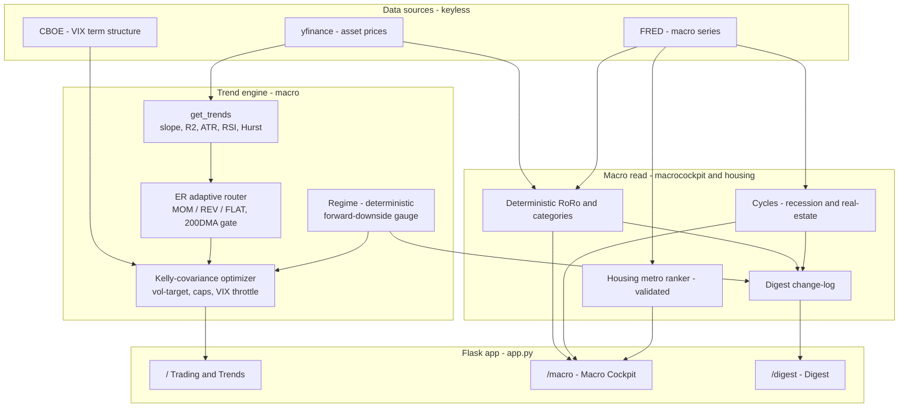

# GSS — Quantitative Trend & Macro System

A Flask dashboard for a **survival-first** multi-asset trend-following book, paired
with a **deterministic** macro read of the economy. The design principle throughout
is intellectual honesty: signals are validated out-of-sample or discarded, the
objective is **drawdown control over beating SPY**, and no part of the live system
depends on an LLM or a black-box model.

All data is **keyless** — `yfinance` (prices) + FRED via `pandas_datareader` (macro)
+ CBOE (VIX term structure). Nothing needs an API key.

---

## System Architecture



**Lazy by tab:** the macro/cockpit/digest data is fetched **only** when those tabs are
opened, so the trading tab never waits on FRED. Disk-cached + incremental.

---

## The three tabs

### 1. Trading & Trends (`/`)
The live book. A ~43-name liquid-ETF universe (`macro.constants.TREND_ASSETS`),
**discretionarily tilted per business cycle** (currently commodity + semiconductor
heavy), traded by a **constant** time-series-momentum (TSMOM) engine:

* **Per-asset signal** — 20-day OLS trend (slope·R²), ATR, RSI, Hurst, and a
  Kaufman **efficiency-ratio router** that routes each name to `MOM` (trend), `REV`
  (RSI-2 oversold in an uptrend), or `FLAT` (cash), all gated on price > 200-day MA.
* **Sizing** — a vol-target regime scalar (SPY realized vol vs its median) + an
  SLSQP **Kelly-covariance optimizer** (inverse-vol, per-name caps, portfolio-vol
  band, max-deploy backstop) + a **VIX term-structure throttle** (backwardation →
  toward cash).
* **Overlays** — `DEFENSIVE_ASSETS` (GLD/SLV/DBC/TLT/**DBMF**) are exempt from the
  risk-off gate and throttle (crisis hedges shouldn't shrink in a crisis);
  `THROTTLED_ASSETS` (countries/long-bond) are capped at 0.3× — kept for the trend
  map's market-structure read, throttled so their whipsaw can't damage the book.
* **Validated** — 20-year walk-forward (`backtest/backtest_4th_tuesday_20y.py`):
  Sharpe ≈ 0.80, **max drawdown −8.1%** through 2008/2018/2020/2022 (SPY −56%).
  It's a capital-preservation profile, not a return engine — by design.

Also on this tab: RSI-2 QQQ tactical mean-reversion, VIX signal, the rule-based
sector/country/commodity **rotation** tiles, and a cached top-10 momentum stock
sleeve.

### 2. Macro Cockpit (`/macro`)
A **deterministic** read of the economy — no LLM, no narrative. Signed risk-on
z-scores → normal-CDF → a 1–100 **RoRo** headline, an 8-category detail table
(growth / labor / consumer / inflation / monetary / liquidity / carry / breadth),
plus the **forward-predictable** signals surfaced explicitly:

* **Cycles** — recession (yield curve + credit + Sahm) and real-estate.
* **Housing** — a walk-forward-validated **metro ranker** (rank IC +0.51) and the
  single strongest housing signal, **months-supply → implied forward-12m HPA**.
* **Rates** — mortgage spread (mean-reverts) and credit spread (HY OAS vs its norm),
  with dashed **norm lines** on every genuinely mean-reverting chart.

### 3. Digest (`/digest`)
A deterministic **change-log** (the honest version of a "news tab"). It snapshots
the cockpit signals daily and reports **what moved vs a week and month ago**, the
threshold crossings, and the net read — **color-coded** green/red/yellow(warn)/
neutral. Templated from numbers, so zero hallucination.

---

## What's predictable (and what isn't)

The system only harvests edges that survive honest out-of-sample testing. The
recurring finding: **persistence, risk premia, and mean-reversion predict;
efficiently-priced direction does not.**

| Predictable ✅ | Not predictable ❌ |
|---|---|
| Housing (autocorr +0.75; metro rank IC +0.51) | Stock / sector cross-sectional direction |
| Months-supply → forward HPA (IC −0.78) | Interest-rate *level* direction (random walk) |
| Yield-curve → bond carry (IC +0.39) + recession | Labor forecasts (lose to persistence) |
| Mortgage / credit spread mean-reversion | Consumer sentiment, most "news" |
| VIX level → forward volatility (IC −0.69) | Every ML model tried (5×, all dead) |

Findings live in the project memory and in `backtest/` (each script documents its
own verdict inline).

---

## Repository layout

```
app.py                     Flask routes: / (trading), /macro, /digest
macro/                     Trend engine
  constants.py             TREND_ASSETS, DEFENSIVE_ASSETS, THROTTLED_ASSETS
  indicators/portfolio.py  get_trends() + Kelly-covariance optimizer
  indicators/regime.py     deterministic regime (weighted forward-downside gauge)
  indicators/rotation.py   sector/country/commodity rankers
macrocockpit/              Deterministic macro read
  macro_board.py           RoRo + categories + credit/mortgage reads
  cycles.py                recession + real-estate (months-supply → HPA)
  housing.py               stale-while-revalidate accessor for the metro ranker
  digest.py                change-log tab
housing/predict_housing.py Validated pooled cross-sectional metro ranker
stockselection/            Momentum(12-1) + 200DMA-gate stock sleeve
backtest/                  Walk-forward validation scripts (each self-documenting)
templates/                 dashboard.html, macro_dashboard.html, digest.html
```

---

## Tech stack
* **Framework:** Flask (single-page, tab-nav, lazy-loaded macro/digest)
* **Data:** `yfinance`, FRED via `pandas_datareader` (keyless), CBOE
* **Compute:** `pandas`, `numpy`, `scipy` (SLSQP optimizer, Spearman IC), `scikit-learn` (housing GBM)
* **Frontend:** Jinja2 + Tailwind (CDN) + Plotly, dark theme

## Quick start
```bash
brew install libomp                 # macOS only
python -m venv venv && source venv/bin/activate
pip install -r requirements.txt
python app.py                        # http://localhost:5000
```
Convenience alias: `alias runapp='cd <repo> && source venv/bin/activate && python app.py'`.

> **Objective, stated plainly:** survival and drawdown control, benchmarked against a
> T-bill floor — *not* beating SPY. The liquid book keeps you alive; concentrated real
> assets (property, business) are where the number gets big. The two are kept separate.
